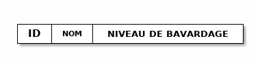
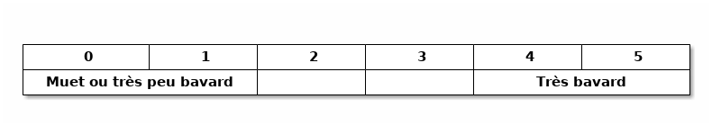

########
À propos
########

*************
Problématique
*************

*Contexte: Élèves d'une classe, places assises dans une salle*

*Contraintes:
Le niveau de bavardage d'un élève, les liens sociaux entre élèves*

Comme tout enseignant j'ai été et je suis encore confronté au problème de la
gestion de classe et plus précisément aux interactions efficaces ou inefficaces
des élèves au sein d'une classe.

En effet, les associations d´élèves bavards entre eux peuvent mettre à mal une séance.
Dissocier une binôme productif peut l'être également.

Pour "régler" cela, la démarche consiste à créer un plan de classe afin de diriger
ou limiter les liens que peuvent avoir les élèves entre eux durant une séance.
Ainsi, j'ai tenté plusieurs fois de casser les bavardages entre plusieurs
camarades en les disposant dans la classe à divers endroits et ce dans le
but d'arriver à un équilibre entre bonne dynamique du groupe classe du point
de vue de l'ambiance et du travail et la limitation des bavardages, de l'inattention.

Voulant également passer la certification ISN, il me fallait trouver un projet
qui m'intéressait et qui semblait pertinent pour le dossier à présenter.

*****************
Solution proposée
*****************

*La solution proposée doit:
- utiliser Python
- être simple d'utilisation (IHM, import de la liste des élèves,...)
- proposer un placement automatique des élèves en fonction de certaines contraintes
- permettre d'éditer cette solution de positionnement ou d'en créer une
- permettre de modifier les contraintes*

**********
Conception
**********

1ère phase de recherche
=======================

J'ai tout d'abord commencé par faire des recherches sur cette thématique.
Au hasard de mes recherches, je suis tombé sur une application web, `xperprof`_,
permettant de génerer un plan de classe.
Cette application propose une fonction de positionnement aléatoire des élèves et
notamment la capacité de ne pas soumettre certaines tables à l'algorithme et ainsi
créer des zones vide autour de certains élèves.
Une première idée d'algorithme m'est venue : le positionnement aléatoire.

J'ai toutefois continué mes recherches et ai vu une analogie de mon projet avec
un jeu d'échec.
Un article du blog de `Jean-François GAZET`_ au sujet la création d'un jeu d'échec m'a apporter quelques idées
pour mon développement. Il m'a aider à définir quelques éléments de l'implémentation, à savoir :

- l'IHM: mode console ou graphique ?
- la façon de représenter un élève, un plan de classe
- la notion de "critères" que j'ai requalifié de "contraintes" pour mon projet
- la stratégie algorithmique pour proposer une solution

Restait un élément à préciser : le format de données utilisé pour contenir la liste des élèves.
Mais ce dernier point n'était qu'une formalité.

IHM
===

J'ai tout de suite souhaité que mon application fonctionne en mode console pour deux raisons :

- la première :
  Pour moi une application doit pouvoir fonctionner en mode console et pouvoir proposer
  une interface graphique au besoin.
  J'espérais ainsi passer la majeure partie du temps pour développer l'API et passer le reste sur
  l'Interface-Homme-Machine.
- la seconde (qui est une conséquence de la première) :
  Compte-tenu du délai qui m'était imposé je ne voulais pas passer trop de temps dans l'apprentissage
  d'une librairie graphique.

Format de la liste des élèves
=============================

Afin de charger directement dans l'application une liste des élèves à manipuler,
il est nécessaire de choisir un format de fichier.

Le format **.csv** est celui retenu, de part sa simplicité à le générer.
Le séparateur de champ sera le point-virgule.

L'en-tête du ficher élèves est la suivante :

Classes ``Student`` et ``SeatingPlan``
======================================

Dans le contexte de la classe, un **élève** est un individu portant certains attributs, comme
un nom, un prénom, une liste d'amis dans cette même classe ou à l'extérieur,...
Un **plan de classe** également peut porter certaines propriétés, comme ses dimensions,
la liste des sièges disponibles, leurs occupants,...

Ces deux éléments peuvent de surcroît interagir.

Il est alors apparu évident de considérer, d'un point de vue informatique, ces notions
comme des structures de données à part entière.
Ainsi leur définition, leur création, leur manipulation s'en trouveraient facilitées.

Dès lors, le choix du paradigme de programmation orientée objet a été décidé.

Deux classes, ont donc été définies pour cela :

- la classe ``Student``, pour définir les élèves
- la classe ``SeatingPlan``, pour définir le plan de classe

Student
-------

Un élève est défini par :

- son nom
- un niveau de bavardage
- une liste d'amis

::

 def __init__(self, name, chat_lvl=0, friends=[]):
       """ Instancie un objet plan de classe.

       :param name:
           Nom de l'élève.
       :type name: str
       :param chat_lvl:
           Coefficient ou niveau de bavardage.
       :type chat_lvl: int
       :param friends:
            Liste d'amis.
       :type friends: list
       """
       self.name = name
       self.chat_lvl = chat_lvl
       self.friends = friends

SeatingPlan
-----------

Un plan de classe est défini par :

- un nombre de rangées
- un nombre de colonnes
- une "cartographie" de la classe

À l'origine, la cartographie de mon plan de classe prenait la forme d'une liste
imbriquée, comme dans `jepychess`_.
Cette représentation a évolué pour une structure plus souple et surtout en adéquation
avec celle utilisée dans l'algorithme de calcul.

::

 def __init__(self, row=5, col=8):
       """ Instancie un objet plan de classe.

       :param row:
           Nombre de rangées dans la classe.
       :type row: int
       :param col:
           Nombre de colonnes dans la classe.
       :type col: int
       :param mapping:
           Représentation du plan de la classe.
       :type mapping: dict
       """
       self.row = row
       self.col = col
       self.mapping = {(i, j): None for i in range(row)
                       for j in range(col)}

Les contraintes
===============

Les contraintes sont les conditions suivant lesquelles on accepte que deux
élèves soient voisins dans le plan de classe.

Pour commencer, celles-ci seront "naïves". C'est-à-dire qu'elles seront basées
sur une valeur entière représentant le niveau de bavardage de l'élève.
Puis, elles sreont redéfinies pour prendre appui sur les relations sociales
entre les élèves (qui est ami avec ami).

Ainsi, deux élèves pourront être voisins si la différence entre leur niveaux
respectifs de bavardage est d'au moins une valeur fixée.
De la même manière, deux élèves pourront être voisins, si leur lien social
est minimal.

Les niveaux ou coefficients de bavardage seront définis comme suit :

2nde phase de recherches : l'algorithme ?
=========================================

Balbutiements
-------------

Initialement, en me basant sur l'exemple de `xperprof`_, j'ai réalisé un placement
aléatoire sous contrainte, des élèves dans le plan de classe.
Le résultat fût concluant mais chaque lancement de cet algorithme produisait une seule proposition
qui pouvait ou non, être complète en raison de contraintes parfois trop fortes.

La première difficulté est ainsi apparue: satisfaire des contraintes tout en proposant des solutions possibles.

L'algorithme **alpha-beta** cité dans le blog de `Jean-François GAZET`_ m'a dirigé vers les méthode de résolution
de jeu d'échec, de dames ou plus généralement de problèmes NP-complet.
Mais également sur le fait de considérer les différentes étapes de recherche de complétion du plan de classe comme
un arbre de recherche.

Mes diverses lectures ainsi que des recherches sur l'Internet m'ont amené au problème des N-Reines.
Diverses méthodes de programmation permettent de résoudre ce problème : comme la programmation par contraintes.

Résoudre un problème de satisfaction de contraintes... ?
--------------------------------------------------------

J'ai vu la résolution de ma problématique comme un problème de satisfaction de contraintes et me suis mis en
quête de réponses concernant la programmation par contraintes.

Plusieurs possibilités

Je me suis alors tourné vers un algorithme avec retour sur trace.

L'algorithme au final
---------------------

Validateur de contraintes
"""""""""""""""""""""""""

::

  def respect_constraints(self, seat, student, seatingplan, solution):
        """Indique si une place associée à une élève satisfait aux
        contraintes, à savoir si :

            - l'élève n'a pas déjà été positionné
            - la place n'est pas déjà occupée
            - la place est libre, que son voisinage est composé de bons voisins
              en termes de bavardages.

        :param seat:
            Place que l'on veut associer à un élève.
        :type seat: tuple
        :param student:
            Élève que l'on veut associer à une place.
        :type student: Student
        :param seatingplan:
            Plan de classe.
        :type seatingplan: SeatingPlan
        :param solution:
            Associations 'place - élève' valides.
        :type solution: dict

        :rtype: bool

        .. todo::
            - Modifier le traitement des contraintes de façon à tolérer
              un certains nombre de voisins ne satisfaisants pas aux
              contraintes.
            - Ajouter les liens sociaux comme contraintes supplémentaires.
        """
        # L'association en cours est supposée valide
        result = True
        # Si l'élève en cours a déjà été traité, l'association est invalide
        if student in solution.values():
            result = False
            # return False
        # Si la place en cours a déjà été traitée, l'association est invalide
        elif seat in solution.keys():
            result = False
            # return False
        else:
            # Si non, veŕifions le voisinage de la place
            # Récupérons le voisinage de la place en cours
            neighbourhood = self.get_neighbourhood(seatingplan,
                                                   seat,
                                                   self.NEIGHBOURHOOD_RADIUS)

            for neighbour_seat in neighbourhood:
                # On ne teste les contraintes que sur les sièges déjà occupés
                # donc sur ceux faisant déjà partie des solutions
                if neighbour_seat in list(solution.keys()):
                    # On récupère l'élève du siège voisin
                    neighbour = solution[neighbour_seat]

                    # Lequel de l'élève en cours ou du voisin
                    # est le plus bavard ?
                    max_chat_lvl = max(student.chat_lvl,
                                       neighbour.chat_lvl)

                    # Les contraintes portent sur la différence de
                    # coefficient de bavardage entre deux voisins:
                    if max_chat_lvl == 5:
                        result = result and self.are_safe_neighbours(
                                            student,
                                            neighbour,
                                            self.DELTA_FOR_MAX_CHAT_LVL_5)

                    elif max_chat_lvl == 4:
                        result = result and self.are_safe_neighbours(
                                                student,
                                                neighbour,
                                                self.DELTA_FOR_MAX_CHAT_LVL_4)

                    elif max_chat_lvl == 3:
                        result = result and self.are_safe_neighbours(
                                                student,
                                                neighbour,
                                                self.DELTA_FOR_MAX_CHAT_LVL_3)

                    elif max_chat_lvl == 2:
                        result = result and self.are_safe_neighbours(
                                                student,
                                                neighbour,
                                                self.DELTA_FOR_MAX_CHAT_LVL_2)

                    elif max_chat_lvl == 1:
                        result = result and self.are_safe_neighbours(
                                                student,
                                                neighbour,
                                                self.DELTA_FOR_MAX_CHAT_LVL_1)

                    else:
                        result = result and True
                # Le siège voisin n'est pas occupé, il est donc valide
                result = result and True
        # retournons la validité de l'association
        return result

Le solveur
""""""""""

::

  def solve(self, seatingplan, students_list):
        """Cherche pour une liste de places et une liste d'élèves, un ensemble
        de dispositions dans un plan de classe respectueuses de certaines
        contraintes décrites dans la fonction 'respect_constraints' ci-dessus.

        :param seatingplan:
            Plan de classe.
        :type seatingplan: SeatingPlan
        :param students_list:
            Liste d'élèves à positionner dans le plan de classe.
        :type students_list: list
        :param solution:
            Solution de placement proposée.
        :type solutions: dict

        :return:
            Disposition des élèves dans le plan de classe.
        :rtype: generator
        """
        # Liste des places
        seats_list = list(seatingplan.mapping.keys())

        # Quantités de places et d'élèves à traiter
        number_of_seats = len(seats_list)
        number_of_students = len(students_list)

        # On stocke nos associations 'place - élève' dans un dictionnaire
        solution = {}

        # Indexes de départ dans nos listes de places et d'élèves
        idx_seat = 0
        idx_student = 0

        # Retour sur trace (backtracking)
        backtrack = False
        # Fin du parcours
        end = False

        # On commence notre recherche
        while not end:
            # On ne revient pas encore en arrière
            while not backtrack:
                # Place à traiter
                current_seat = seats_list[idx_seat]
                # Élève à traiter
                current_student = students_list[idx_student]

                # L'association 'place - élève' est-elle satisfaisante ?
                if self.respect_constraints(current_seat,
                                            current_student,
                                            seatingplan,
                                            solution):
                    # Oui, alors associons l'élève à cette place
                    solution[current_seat] = current_student

                    # Est-ce qu'on a traité tous les élèves dans
                    # notre parcourt ?
                    if (idx_student == number_of_students-1):
                        # Oui, alors renvoyons notre solution
                        yield {p: s for p, s in solution.items()}
                        del solution[current_seat]

                        # A-t'on traité toutes les places ?
                        if (idx_seat != number_of_seats-1):
                            # Non, on passe à la suivante
                            idx_seat = idx_seat + 1
                        else:
                            # Oui, on revient en arrière
                            backtrack = True
                    else:
                        # Non, on passe au suivant en recommençant à la
                        # première place
                        idx_seat = 0
                        idx_student = idx_student + 1

                # Les contraintes n'ont pas été satisfaites,
                # il nous reste des places à traiter
                elif (idx_seat != number_of_seats-1):
                    # On passe à la suivante
                    idx_seat = idx_seat + 1

                else:
                    # Si non, on revient en arrière
                    backtrack = True

            # Sommes-nous remonté jusqu'au premier élève ?
            end = (idx_student == 0)

            # On revient sur nos pas...
            while (backtrack and not end):
                # Prenons l'élève précédent
                idx_student = idx_student - 1
                current_student = students_list[idx_student]
                # On récupère (et on enlève des solutions) la place qui lui
                # est associée
                current_seat = list(solution.keys())[list(solution.values())
                                                     .index(current_student)]
                solution.pop(current_seat)
                idx_seat = seats_list.index(current_seat)

                # Il nous reste des places
                if (idx_seat != number_of_seats-1):
                    # Prenons la place suivante et stoppons notre retour
                    # en arrière
                    idx_seat = idx_seat + 1
                    backtrack = False
                # Ou nous sommes revenu au premier élève, on stop là
                elif idx_student == 0:
                    end = True

********************************
Bilan et améliorations possibles
********************************

L'algorithme fonctionne bien dès lors que l'échantillon d'élèves n'est pas trop grand.

.. _xperprof: https://www.xperprof.fr/generateur_plan_de_classe
.. _Jean-François GAZET: https://fr.jeffprod.com/blog/2014/comment-programmer-un-jeu-dechecs.html
.. _jepychess: `Jean-François GAZET`_
